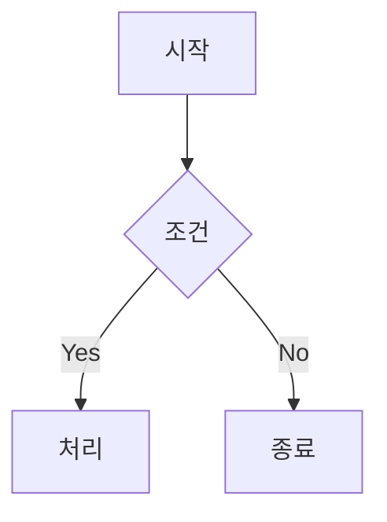
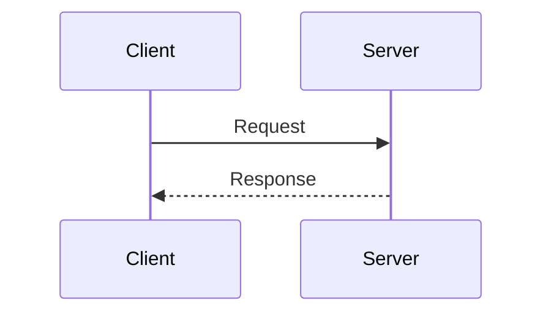
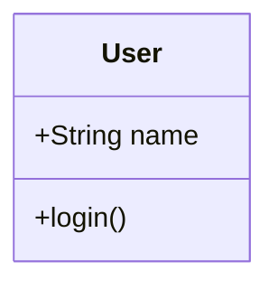
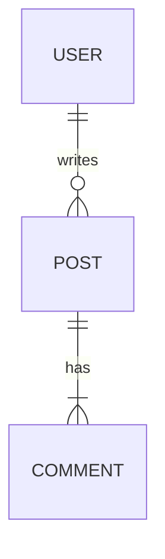
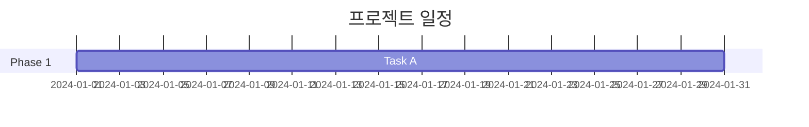

# /docs:diagram

Confluence 페이지에 Mermaid 다이어그램을 추가한다.

## Arguments
- page_id: Confluence 페이지 ID (필수)
- type: 다이어그램 유형 (flowchart, sequence, class, er, gantt 등)
- title: 다이어그램 제목

## Mermaid Cloud 매크로 형식

"Mermaid Diagrams for Confluence" 앱은 다이어그램 코드를 별도 저장한다.
API로 매크로 생성은 가능하지만, 코드는 Confluence UI에서 직접 입력해야 한다.

### Storage Format
```xml
<ac:structured-macro ac:name="mermaid-cloud" ac:schema-version="1" data-layout="default">
  <ac:parameter ac:name="toolbar">bottom</ac:parameter>
  <ac:parameter ac:name="filename">다이어그램 이름</ac:parameter>
  <ac:parameter ac:name="zoom">fit</ac:parameter>
  <ac:parameter ac:name="revision">1</ac:parameter>
</ac:structured-macro>
```

### Parameters
| Parameter | Value | Description |
|-----------|-------|-------------|
| toolbar | bottom/top/none | 툴바 위치 |
| filename | string | 다이어그램 식별자 |
| zoom | fit/100/150/200 | 확대/축소 수준 |
| revision | number | 버전 번호 |

## Instructions

1. 요청된 다이어그램 유형에 맞는 Mermaid 코드를 생성한다
2. Confluence 페이지에 mermaid-cloud 매크로 placeholder를 추가한다
3. 사용자에게 다이어그램 코드와 수동 입력 방법을 안내한다

## Workflow

### Step 1: 매크로 Placeholder 생성
```xml
<h2>다이어그램 제목</h2>
<ac:structured-macro ac:name="mermaid-cloud" ac:schema-version="1" data-layout="default">
  <ac:parameter ac:name="toolbar">bottom</ac:parameter>
  <ac:parameter ac:name="filename">unique-diagram-name</ac:parameter>
  <ac:parameter ac:name="zoom">fit</ac:parameter>
  <ac:parameter ac:name="revision">1</ac:parameter>
</ac:structured-macro>
```

### Step 2: 사용자 안내
```
1. Confluence 페이지를 엽니다: [페이지 URL]
2. 편집 모드로 진입합니다 (Edit 버튼)
3. 빈 Mermaid 블록을 클릭합니다
4. 아래 코드를 붙여넣습니다:

[Mermaid 코드]
```

## Diagram Types

### flowchart (시스템 구성도, 프로세스 흐름)


### sequenceDiagram (요청 흐름, API 통신)


### classDiagram (클래스 구조)


### erDiagram (데이터베이스 스키마)


### gantt (프로젝트 일정)


## MCP Tools
- **Confluence**: confluence_update_page (storage format)

## Notes
- Mermaid Diagrams for Confluence 앱 설치 필요
- 다이어그램 코드는 앱 내부 저장소에 저장됨
- API로 직접 코드 삽입 불가 (매크로만 생성 가능)
- 복잡한 다이어그램은 수동 입력 권장
