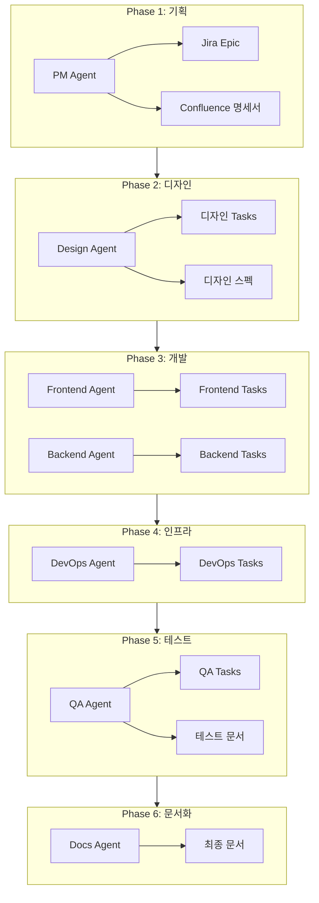

# /new-feature

새로운 기능을 기획하고 모든 팀 에이전트가 협업하여 작업을 정의한다.

## Arguments
- name: 기능명 (영문, kebab-case)
- description: 기능 설명

## Agents
각 단계에서 팀별 에이전트를 순차적으로 실행한다.

| Phase | Agent | Context |
|-------|-------|---------|
| 1. 기획 | PM Agent | `.claude/agents/pm.md` |
| 2. 디자인 | Design Agent | `.claude/agents/design.md` |
| 3. 개발 | Frontend/Backend Agent | `.claude/agents/frontend.md`, `.claude/agents/backend.md` |
| 4. 인프라 | DevOps Agent | `.claude/agents/devops.md` |
| 5. 테스트 | QA Agent | `.claude/agents/qa.md` |
| 6. 문서화 | Docs Agent | `.claude/agents/docs.md` |

## Instructions

### Phase 1: PM Agent - 기획 및 Epic 생성
```
Task(subagent_type="general-purpose", prompt="
PM Agent로서 새 기능을 기획하라.
Context: .claude/agents/pm.md

기능명: {name}
설명: {description}

수행 작업:
1. Jira Epic 생성 (ECS 프로젝트)
2. 요구사항 분석 및 정리
3. 팀별 의존성 파악
4. Confluence 기능 명세서 생성
5. Epic-Confluence 연동
")
```

**Output:**
- Jira Epic: ECS-XX
- Confluence: 기능 명세서 페이지

### Phase 2: Design Agent - 디자인 스펙 정의
```
Task(subagent_type="general-purpose", prompt="
Design Agent로서 기능의 디자인 스펙을 정의하라.
Context: .claude/agents/design.md

Epic: ECS-XX
기능명: {name}

수행 작업:
1. UX 플로우 설계
2. UI 컴포넌트 목록 정의
3. Tailwind 클래스 가이드
4. Jira 디자인 Task 생성 (Epic 하위)
5. Confluence 디자인 스펙 문서
")
```

**Output:**
- Jira Tasks: ECS-XX (디자인)
- Confluence: 디자인 스펙 페이지

### Phase 3: Frontend/Backend Agent - 개발 Task 정의
```
# Frontend Agent
Task(subagent_type="general-purpose", prompt="
Frontend Agent로서 개발 Task를 정의하라.
Context: .claude/agents/frontend.md

Epic: ECS-XX
기능명: {name}

수행 작업:
1. 컴포넌트 목록 정의
2. 페이지 구현 계획
3. API 연동 포인트 정의
4. Jira Frontend Tasks 생성
")

# Backend Agent
Task(subagent_type="general-purpose", prompt="
Backend Agent로서 개발 Task를 정의하라.
Context: .claude/agents/backend.md

Epic: ECS-XX
기능명: {name}

수행 작업:
1. API 엔드포인트 설계
2. DB 스키마 설계
3. 비즈니스 로직 정의
4. Jira Backend Tasks 생성
")
```

**Output:**
- Jira Tasks: ECS-XX (Frontend)
- Jira Tasks: ECS-XX (Backend)

### Phase 4: DevOps Agent - 인프라 준비
```
Task(subagent_type="general-purpose", prompt="
DevOps Agent로서 인프라 요구사항을 정의하라.
Context: .claude/agents/devops.md

Epic: ECS-XX
기능명: {name}

수행 작업:
1. 인프라 변경 사항 파악
2. 환경 설정 계획
3. 배포 파이프라인 업데이트 필요 여부
4. Jira DevOps Tasks 생성
")
```

**Output:**
- Jira Tasks: ECS-XX (DevOps)

### Phase 5: QA Agent - 테스트 계획
```
Task(subagent_type="general-purpose", prompt="
QA Agent로서 테스트 계획을 수립하라.
Context: .claude/agents/qa.md

Epic: ECS-XX
기능명: {name}

수행 작업:
1. 테스트 시나리오 정의
2. 인수 기준 작성
3. QA 체크리스트 생성
4. Jira QA Tasks 생성
5. Confluence 테스트 문서
")
```

**Output:**
- Jira Tasks: ECS-XX (QA)
- Confluence: 테스트 계획 페이지

### Phase 6: Docs Agent - 문서화 완료
```
Task(subagent_type="general-purpose", prompt="
Docs Agent로서 기능 문서를 정리하라.
Context: .claude/agents/docs.md

Epic: ECS-XX
기능명: {name}

수행 작업:
1. 전체 문서 구조 검토
2. 아키텍처 다이어그램 추가
3. API 문서 템플릿 준비
4. 문서 간 링크 연결
")
```

**Output:**
- Confluence: 문서 구조 완성
- Mermaid 다이어그램 코드

## Workflow Diagram



## Output

### Jira
- Epic: ECS-XX ({name})
- Tasks: 팀별 하위 Task

### Confluence (DOCS Space)
- 기능 명세서
- 디자인 스펙
- API 문서
- 테스트 계획

### 구조
```
Jira Epic (ECS-XX)
├── [PM] 요구사항 정의
├── [Design] UX/UI 설계
├── [Frontend] 컴포넌트 개발
├── [Backend] API 개발
├── [DevOps] 인프라 설정
└── [QA] 테스트 수행

Confluence (DOCS)
└── {name}/
    ├── 기능 명세서
    ├── 디자인 스펙
    ├── API 문서
    └── 테스트 계획
```

## Example

```bash
/new-feature user-authentication "사용자 인증 기능 (로그인/회원가입)"
```

실행 결과:
1. PM Agent → Epic ECS-100 생성
2. Design Agent → 로그인/회원가입 UI 스펙
3. Frontend Agent → Blade 컴포넌트 Task
4. Backend Agent → Auth API Task
5. DevOps Agent → 세션/토큰 설정 Task
6. QA Agent → 인증 테스트 시나리오
7. Docs Agent → 인증 문서 정리
