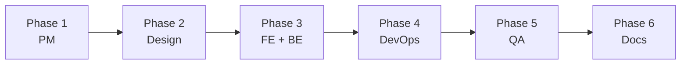

# /new-feature

새로운 기능을 기획하고 모든 팀 에이전트가 협업하여 작업을 정의한다.

## Arguments
- $1: 기능명 (영문, kebab-case)
- $2: 기능 설명

## Agents

| Phase | Agent | Context File |
|-------|-------|--------------|
| 1 | PM | `.claude/agents/pm.md` |
| 2 | Design | `.claude/agents/design.md` |
| 3 | Frontend | `.claude/agents/frontend.md` |
| 3 | Backend | `.claude/agents/backend.md` |
| 4 | DevOps | `.claude/agents/devops.md` |
| 5 | QA | `.claude/agents/qa.md` |
| 6 | Docs | `.claude/agents/docs.md` |

## Instructions

### Phase 1: PM Agent
`.claude/agents/pm.md` 컨텍스트를 읽고 다음을 수행하라:

1. Jira Epic 생성 (ECS 프로젝트)
   - 제목: `[Epic] $1 - $2`
   - 유형: Epic
2. 요구사항 분석 및 정리
3. 팀별 의존성 파악
4. Confluence 기능 명세서 생성 (DOCS 스페이스)
5. Jira Epic과 Confluence 페이지 연동

### Phase 2: Design Agent
`.claude/agents/design.md` 컨텍스트를 읽고 다음을 수행하라:

1. UX 플로우 설계
2. UI 컴포넌트 목록 정의
3. Tailwind 클래스 가이드
4. Jira 디자인 Task 생성 (Epic 하위)
5. Confluence 디자인 스펙 문서 작성

### Phase 3: Frontend/Backend Agent (병렬 실행)

**Frontend** (`.claude/agents/frontend.md`):
1. 컴포넌트 목록 정의
2. 페이지 구현 계획
3. API 연동 포인트 정의
4. Jira Frontend Tasks 생성

**Backend** (`.claude/agents/backend.md`):
1. API 엔드포인트 설계
2. DB 스키마 설계
3. 비즈니스 로직 정의
4. Jira Backend Tasks 생성

### Phase 4: DevOps Agent
`.claude/agents/devops.md` 컨텍스트를 읽고 다음을 수행하라:

1. 인프라 변경 사항 파악
2. 환경 설정 계획
3. 배포 파이프라인 업데이트 필요 여부
4. Jira DevOps Tasks 생성

### Phase 5: QA Agent
`.claude/agents/qa.md` 컨텍스트를 읽고 다음을 수행하라:

1. 테스트 시나리오 정의
2. 인수 기준 작성
3. QA 체크리스트 생성
4. Jira QA Tasks 생성
5. Confluence 테스트 문서 작성

### Phase 6: Docs Agent
`.claude/agents/docs.md` 컨텍스트를 읽고 다음을 수행하라:

1. 전체 문서 구조 검토
2. 아키텍처 다이어그램 추가 (Mermaid)
3. API 문서 템플릿 준비
4. 문서 간 링크 연결

## Output

### Jira (ECS 프로젝트)
```
Epic: ECS-XX ($1)
├── [PM] 요구사항 정의
├── [Design] UX/UI 설계
├── [Frontend] 컴포넌트 개발
├── [Backend] API 개발
├── [DevOps] 인프라 설정
└── [QA] 테스트 수행
```

### Confluence (DOCS 스페이스)
```
$1/
├── 기능 명세서
├── 디자인 스펙
├── API 문서
└── 테스트 계획
```

## Workflow



## Example

```
/new-feature user-authentication "사용자 인증 기능 (로그인/회원가입)"
```

실행 순서:
1. PM Agent → Epic ECS-XX 생성, 요구사항 문서화
2. Design Agent → 로그인/회원가입 UI 스펙
3. Frontend Agent → Blade 컴포넌트 Task
4. Backend Agent → Auth API Task
5. DevOps Agent → 세션/토큰 설정 Task
6. QA Agent → 인증 테스트 시나리오
7. Docs Agent → 인증 문서 정리
